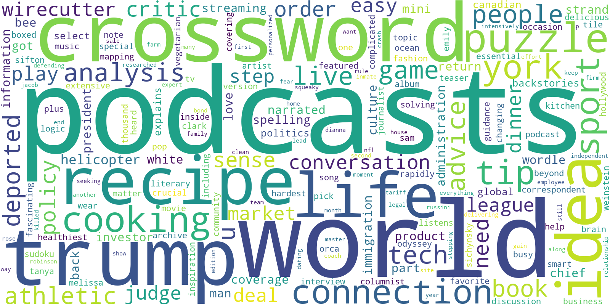

# The World in Words: Making a Word Cloud out of The New York Times Homepage

**Using Python and NLP to visualize the world — in words.**

All the news that's fit to code.

## Project Overview

This notebook scrapes the [nytimes.com](https://www.nytimes.com) homepage, tokenizes and cleans the text, 
and generates a word cloud to reflect what’s trending in global headlines.

The project showcases fundamentals of **Natural Language Processing (NLP)**, including tokenization, stop 
word removal, lemmatization, and frequency visualization — all in Python.

## Sample Word Cloud
Here's the word cloud from scraping the NYT homepage on April 11, 2025.

## Tools & Libraries Used
- **Jupyter Notebook** — for writing and running Python code interactively
- **Python 3.12.2**
- **nltk** - NLP preprocessing (toeknize, stopwors, lemmatize)
- **gensim** - Text tokenization
- **Beautifulsoup** - Web scraping
- **wordcloud** - Word frequency rendering
- **matplotlib** - Visualization and word cloud display

## Acknowledgements

This project is based on the notebooks provided by Michele Samorani Associate Professor, Information Systems & Analytics
the Leavey School of Business at Santa Clara University. Professor Samorani's guidance in our NLP class made this project 
possible, allowing me to apply and extend the concepts covered in the course to build this word cloud.

## Note
This notebook is a work in progress. The only way to code is to practice. Stay tuned for more.
